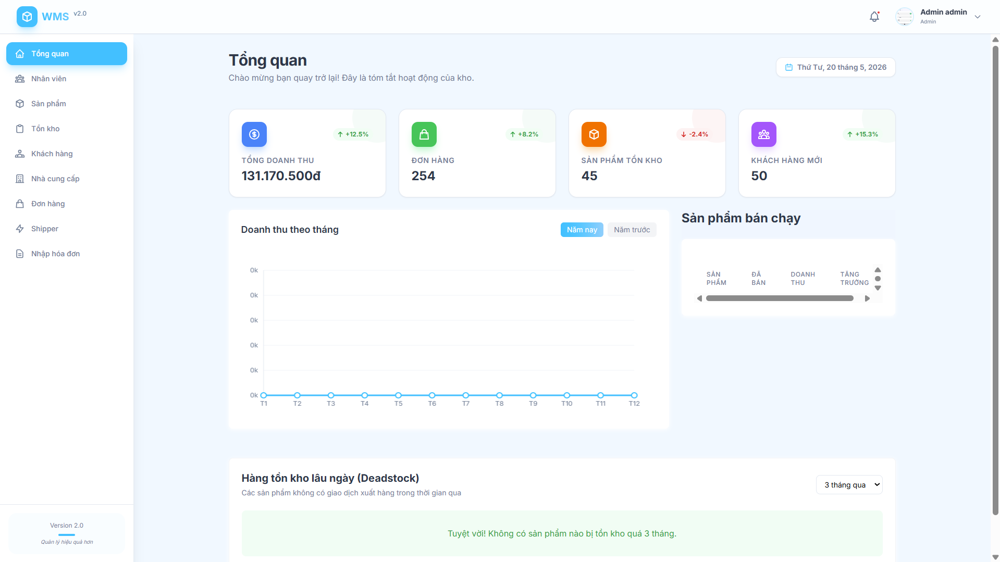

# 📦 Hệ Thống Quản Lý Kho Hàng Thông Minh (Advanced WMS - Smart Warehouse)

<div align="center">
  
  
  
  
  
  
</div>

---

## 📑 Mục lục
1. [🌟 Tổng quan dự án](#-tổng-quan-dự-án)
2. [💡 Tầm nhìn và Mục tiêu](#-tầm-nhìn-và-mục-tiêu)
3. [🛠️ Hệ sinh thái Công nghệ](#-hệ-sinh-thái-công-nghệ)
4. [🏗️ Kiến trúc Hệ thống (Architecture)](#-kiến-trúc-hệ-thống-architecture)
5. [🧬 Thiết kế Cơ sở Dữ liệu (Database Schema)](#-thiết-kế-cơ-sở-dữ-liệu-database-schema)
6. [🚀 Tính năng Chi tiết từng Phân hệ](#-tính-năng-chi-tiết-từng-phân-hệ)
7. [🛣️ Đặc tả API (API Documentation)](#-đặc-tả-api-api-documentation)
8. [📂 Cấu trúc Thư mục Toàn diện](#-cấu-trúc-thư-mục-toàn-diện)
9. [⚙️ Hướng dẫn Cài đặt và Triển khai](#-hướng-dẫn-cài-đặt-và-triển-khai)
10. [🔐 Bảo mật và Hiệu năng](#-bảo-mật-và-hiệu-năng)
11. [📸 Giao diện Người dùng](#-giao-diện-người-dùng)
12. [🗺️ Lộ trình Phát triển (Roadmap)](#-lộ-trình-phát-triển-roadmap)
13. [🤝 Đóng góp và Liên hệ](#-đóng-góp-và-liên-hệ)

---

## 🌟 Tổng quan dự án

**Smart WMS (XD_HTTQL)** là một giải pháp quản trị kho hàng hiện đại, được xây dựng để tối ưu hóa chuỗi cung ứng của doanh nghiệp. Hệ thống không chỉ đơn thuần là công cụ nhập/xuất hàng, mà là một trung tâm điều phối thông minh giúp doanh nghiệp kiểm soát hàng tồn, tối ưu vận chuyển và đưa ra các quyết định kinh doanh dựa trên dữ liệu thực tế.

Hệ thống hỗ trợ đầy đủ quy trình từ lúc hàng hóa rời nhà máy sản xuất cho đến khi đến tay người tiêu dùng cuối cùng, bao gồm cả các khâu trung gian như quản lý lô hàng, kiểm soát hạn sử dụng và điều phối đội ngũ giao hàng chuyên nghiệp.

---

## 💡 Tầm nhìn và Mục tiêu

- **Tầm nhìn:** Trở thành nền tảng quản trị kho bãi mã nguồn mở phổ biến nhất cho các doanh nghiệp vừa và nhỏ tại Việt Nam.
- **Mục tiêu chiến lược:**
    - Giảm 30% thời gian xử lý đơn hàng thông qua quy trình tự động.
    - Loại bỏ 100% sai sót trong việc quản lý hạn sử dụng bằng hệ thống cảnh báo lô hàng.
    - Cung cấp báo cáo tài chính và hàng tồn kho tức thời (Real-time Reporting).

---

## 🛠️ Hệ sinh thái Công nghệ

Dự án được xây dựng trên những công nghệ tiên tiến nhất nhằm đảm bảo tính mở rộng và khả năng bảo trì lâu dài.

### **Frontend Layer (Giao diện hiện đại)**
- **React 19:** Tận dụng tối đa các tính năng mới như Concurrent Rendering và Server Components (nếu cần).
- **Redux Toolkit:** Quản lý trạng thái ứng dụng một cách khoa học, dễ debug với Redux DevTools.
- **TanStack Query (React Query):** Quản lý trạng thái Server-side, caching dữ liệu thông minh và tự động đồng bộ.
- **Tailwind CSS v4:** Sử dụng CSS-first engine mới nhất cho hiệu năng xử lý style cực nhanh.
- **Recharts:** Thư viện biểu đồ mạnh mẽ cho các báo cáo Dashboard.
- **Lucide Icons:** Bộ icon vector sắc nét, nhẹ và hiện đại.

### **Backend Layer (Xử lý mạnh mẽ)**
- **Node.js & Express 5.x:** Runtime và Framework web thế hệ mới, hỗ trợ tốt hơn cho async/await và xử lý lỗi.
- **Sequelize ORM:** Công cụ tương tác DB mạnh mẽ với tính năng migration và validation tích hợp.
- **JWT (Json Web Token):** Cơ chế xác thực an toàn, không trạng thái (stateless).
- **Multer:** Xử lý upload hình ảnh sản phẩm và tài liệu liên quan.

### **Database & Infrastructure**
- **MySQL 8.0:** Hệ quản trị CSDL quan hệ tin cậy, tối ưu cho các truy vấn phức tạp.
- **GitHub Actions:** Tự động hóa pipeline CI/CD (Lint -> Build -> Test).

---

## 🏗️ Kiến trúc Hệ thống (Architecture)

Chúng tôi áp dụng mô hình **Layered Architecture (Kiến trúc phân tầng)** nhằm tách biệt các trách nhiệm (Separation of Concerns):

1.  **Tầng Controller:** Chỉ nhận yêu cầu, gọi dịch vụ và trả về phản hồi. Không chứa logic nghiệp vụ.
2.  **Tầng Service (Business Logic):** Nơi thực hiện các tính toán, quy trình nghiệp vụ chính của hệ thống.
3.  **Tầng Repository/Model:** Giao tiếp trực tiếp với cơ sở dữ liệu thông qua Sequelize.
4.  **Tầng Middleware:** Kiểm tra quyền hạn, xác thực token và validate dữ liệu đầu vào.

---

## 🧬 Thiết kế Cơ sở Dữ liệu (Database Schema)

Hệ thống bao gồm hơn 15 bảng được thiết kế chuẩn hóa (Normalize) để tránh dư thừa dữ liệu:

- **Users:** Lưu trữ thông tin tài khoản, phân quyền (Admin, Manager, Staff).
- **Products:** Thông tin gốc về sản phẩm (Tên, mô tả, hình ảnh, mã vạch).
- **Stocks & StockBatches:** Quản lý số lượng tồn kho theo từng lô hàng cụ thể để theo dõi hạn sử dụng.
- **ImportReceipts & ImportDetails:** Quản lý lịch sử nhập hàng từ nhà cung cấp.
- **ExportReceipts & ExportDetails:** Quản lý lịch sử xuất hàng cho khách hàng.
- **Orders & OrderItems:** Quản lý đơn hàng đặt hàng từ phía người dùng/khách hàng.
- **Customers & Suppliers:** Danh mục đối tác kinh doanh.
- **Shippers:** Thông tin đội ngũ giao hàng và tọa độ để tính toán khoảng cách.
- **InventoryLogs:** Nhật ký chi tiết mọi biến động kho (Sản phẩm nào, số lượng bao nhiêu, ai thay đổi, lúc nào).

---

## 🚀 Tính năng Chi tiết từng Phân hệ

### 📦 1. Quản lý Sản phẩm & Danh mục
- CRUD sản phẩm với hỗ trợ upload nhiều hình ảnh.
- Tự động tạo mã QR cho mỗi sản phẩm để phục vụ kiểm kho bằng mobile.
- Phân loại sản phẩm theo danh mục đa cấp.

### 📉 2. Kiểm soát Tồn kho Thông minh
- **Cảnh báo ngưỡng tồn:** Tự động đánh dấu các sản phẩm có số lượng thấp hơn `minStock`.
- **Quản lý theo Lô (Batching):** Theo dõi từng đợt hàng nhập vào. Ưu tiên xuất hàng gần hết hạn trước (FEFO).
- **Nhật ký biến động:** Truy xuất nguồn gốc mọi thay đổi số lượng kho từ trước đến nay.

### 🚚 3. Vận chuyển & Logistics
- **Tìm kiếm Shipper gần nhất:** Sử dụng thuật toán tính khoảng cách (Haversine formula) để tìm Shipper phù hợp cho đơn hàng.
- **Trạng thái giao hàng:** Cập nhật real-time từ lúc chờ lấy hàng đến khi giao thành công.

### 💰 4. Kinh doanh & Tài chính
- Lập hóa đơn xuất kho chuyên nghiệp.
- Tính toán doanh thu, lợi nhuận gộp dựa trên giá nhập và giá bán.

### 📊 5. Hệ thống Báo cáo (Analytics)
- **Top Selling:** Danh sách sản phẩm bán chạy nhất theo tháng/quý.
- **Deadstock Report:** Báo cáo các sản phẩm tồn kho lâu ngày không có giao dịch để có kế hoạch xả hàng.
- **Revenue Growth:** Biểu đồ tăng trưởng doanh thu so với cùng kỳ.

---

## 🛣️ Đặc tả API (API Documentation)

Hệ thống cung cấp hệ thống API mạnh mẽ (Prefix: `/api/v1`):

### **Nhóm Sản phẩm (`/products`)**
- `GET /`: Lấy toàn bộ danh sách sản phẩm (có phân trang).
- `POST /create`: Thêm mới sản phẩm (Yêu cầu quyền Admin/Manager).
- `PUT /edit/:id`: Cập nhật thông tin sản phẩm.
- `DELETE /delete/:id`: Xóa sản phẩm (Admin duy nhất).

### **Nhóm Đơn hàng (`/orders`)**
- `GET /get-all`: Xem danh sách đơn hàng.
- `POST /create`: Tạo đơn hàng mới.
- `GET /find-nearest-shipper`: Tìm shipper khả dụng gần vị trí đơn hàng.

### **Nhóm Thống kê (`/statistics`)**
- `GET /revenue`: Tổng doanh thu.
- `GET /top-products`: Danh sách 10 sản phẩm bán chạy nhất.
- `GET /deadstock`: Danh sách hàng tồn đọng trên 90 ngày.

*(Và hơn 40 endpoints khác cho khách hàng, nhà cung cấp, lô hàng...)*

---

## 📂 Cấu trúc Thư mục Toàn diện

```text
XD_HTTQL/
├── 📂 backend/
│   ├── 📂 src/
│   │   ├── 📂 config/       # Cấu hình DB, JWT, Mail server
│   │   ├── 📂 controller/   # Xử lý Request, gọi Service
│   │   ├── 📂 middleware/   # Auth, Role-check, Multer config
│   │   ├── 📂 migrations/   # Script tạo/sửa bảng Database
│   │   ├── 📂 models/       # Định nghĩa thực thể Sequelize
│   │   ├── 📂 routers/      # Định tuyến các module API
│   │   ├── 📂 seeders/      # Dữ liệu mẫu (Demo data)
│   │   ├── 📂 services/     # Tầng chứa 100% Logic nghiệp vụ
│   │   └── 📂 utils/        # Common functions (Hash, Format)
│   └── service.js           # File khởi chạy server chính
│
├── 📂 frontend/
│   ├── 📂 src/
│   │   ├── 📂 API/          # Cấu hình Axios & React Query hooks
│   │   ├── 📂 components/   # UI Library (Common & Specific)
│   │   ├── 📂 redux/        # Store, Slices & Thunks
│   │   ├── 📂 auth/         # Logic đăng nhập, bảo vệ Route
│   │   └── App.jsx          # Cấu hình Route & Provider chính
│   └── vite.config.js       # Cấu hình build tối ưu
│
└── 📂 public/               # Tài liệu hướng dẫn & Ảnh screenshot
```

---

## ⚙️ Hướng dẫn Cài đặt và Triển khai

### 1. Chuẩn bị môi trường
- Cài đặt Node.js Lts (v18 trở lên).
- Cài đặt MySQL Server và tạo một database trống (VD: `wms_pro`).

### 2. Triển khai Backend
```bash
cd backend
npm install
cp .env.example .env # Sau đó cấu hình DB_NAME, DB_USER, DB_PASS, JWT_SECRET
npx sequelize-cli db:migrate
npx sequelize-cli db:seed:all
npm start
```

### 3. Triển khai Frontend
```bash
cd frontend
npm install
npm run dev
```

---

## 🔐 Bảo mật và Hiệu năng

- **Bảo mật:**
    - Password được băm bằng `bcrypt` với 10 rounds.
    - Token JWT được bảo vệ trong `HttpOnly Cookie` để chống XSS.
    - Validation dữ liệu đầu vào bằng `Joi` hoặc `Zod` (tùy module).
- **Hiệu năng:**
    - Database được đánh Index trên các trường tìm kiếm thường xuyên (Product SKU, Order ID).
    - Frontend sử dụng `React.memo` và `useMemo` để giảm thiểu re-render không cần thiết.
    - Caching dữ liệu API với React Query giúp giảm 60% số lượng request lên server.

---

## 📸 Giao diện Người dùng

Hệ thống được thiết kế theo phong cách **Clean Design**, tập trung vào trải nghiệm người dùng (UX) trong môi trường công nghiệp/kho vận:

<div align="center">
  
</div>

---

## 🗺️ Lộ trình Phát triển (Roadmap)

- [x] **Giai đoạn 1:** Hoàn thiện khung xương API và Database (Đã xong).
- [x] **Giai đoạn 2:** Phát triển giao diện Dashboard và Quản lý cơ bản (Đã xong).
- [ ] **Giai đoạn 3:** Tích hợp AI để dự báo nhu cầu hàng tồn kho (Đang nghiên cứu).
- [ ] **Giai đoạn 4:** Phát triển ứng dụng Mobile (React Native) cho nhân viên kho quét QR.
- [ ] **Giai đoạn 5:** Hỗ trợ đa ngôn ngữ (i18n) và đa kho hàng (Multi-warehouse).

---

## 🤝 Đóng góp và Liên hệ

Chúng tôi luôn hoan nghênh mọi sự đóng góp từ cộng đồng. Nếu bạn phát hiện lỗi hoặc có ý tưởng mới, vui lòng:
1. Mở một **Issue** để thảo luận.
2. Fork dự án và tạo một **Pull Request**.

**Liên hệ:**
- **Email:** support@group0.com
- **Website:** [www.group0-wms.com](http://example.com)
- **Địa chỉ:** Khu công nghệ cao, TP. Hồ Chí Minh.

---
<div align="center">
  <b>© 2026 Group 0 - Bản quyền thuộc về đội ngũ phát triển XD_HTTQL.</b><br>
  <i>"Quản lý thông minh - Vận hành bền vững"</i>
</div>
